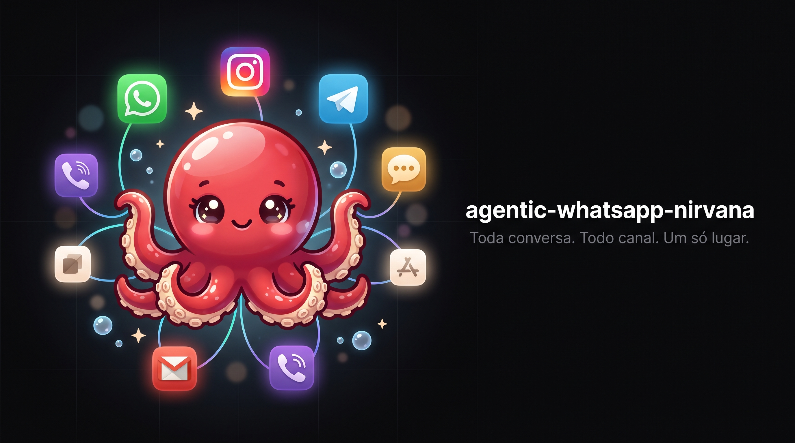

  

<h1 align="center">agentic-whatsapp-nirvana</h1>

<strong>Toda conversa. Todo canal. Um só lugar.</strong>

  
  
  
  
  

  

---

## O problema que ninguém resolve de verdade

Um cliente te chama no WhatsApp de manhã. À tarde, o mesmo cliente comenta num post do Instagram. No dia seguinte, manda um e-mail perguntando a mesma coisa. Três conversas, três apps, três históricos soltos, e nenhum deles sabe da existência do outro.

Você abre seis abas para responder um lead. O WhatsApp num celular, o Instagram noutro, o Telegram no navegador, o e-mail numa caixa que ninguém olha. A resposta que era pra sair em dois minutos sai em duas horas. E o lead, que estava quente, já comprou do concorrente que respondeu primeiro.

O CRM? Existe. Está lá, vazio, porque preencher CRM à mão no meio de vinte conversas simultâneas é um trabalho que nenhuma equipe faz de forma consistente. Então o conhecimento sobre cada cliente mora na cabeça de quem atendeu. Quando essa pessoa sai, sai com ela tudo o que sabia.

Essa é a rotina real de quem vende conversando. Não é falta de esforço. É falta de um lugar onde a conversa inteira vive junta, organizada, pesquisável, e onde alguém, ou algo, já sabe quem é o cliente antes de você digitar a primeira letra.

## A virada

O agentic-whatsapp-nirvana pega WhatsApp, Instagram, Telegram, SMS, e-mail e voz e junta tudo debaixo de um único contato. A pessoa que te chamou no WhatsApp e comentou no Instagram vira uma pessoa só, com um histórico só, numa tela só.

Cada mensagem que entra, por qualquer canal, deixa de ser texto perdido e vira conhecimento estruturado. Áudio é transcrito. Intenção é identificada. O contato entra num CRM em grafo que o assistente consulta em milissegundos. E quando chega a hora de responder, o assistente responde, ou te sugere a resposta, no mesmo canal em que o cliente falou, podendo trocar de canal quando fizer sentido.

Tudo isso roda na sua máquina. Local-first, privado, sob seu controle. Nada da sua operação sobe pra lugar nenhum.

## O que ele faz pelo seu negócio

A tabela abaixo não lista funcionalidades. Lista o que muda na sua operação.

| Recurso | O ganho concreto |
| --- | --- |
| **Omnichannel unificado** | WhatsApp, Instagram, Telegram, SMS, e-mail e voz sob o mesmo contato. Fim das seis abas. Uma conversa, um histórico. |
| **CRM em grafo** | O assistente já sabe quem é o cliente, o que ele comprou, o que perguntou da última vez. Consulta em milissegundos, sem ninguém preencher planilha. |
| **Funil kanban agêntico** | Cada lead numa coluna, movendo-se de estágio de forma automática por intenção. Você vê o pipeline inteiro de atendimento sem perguntar pra ninguém como está. |
| **Busca híbrida semântica** | Encontra qualquer conversa por palavra-chave e por significado, 100% local e offline. "Aquele cliente que reclamou do prazo em maio" vira resultado, não caça ao tesouro. |
| **Voz por IA** | Ligações atendidas e feitas por IA, no mesmo fluxo dos outros canais. O que foi dito ao telefone entra no mesmo histórico do WhatsApp. |
| **Dashboard de conversão de leads** | Onde os leads entram, onde travam, onde fecham. Números coloridos que dizem o que fazer, não gráficos pra decorar a tela. |
| **Comentário → DM no Instagram** | Comentou no post? O sistema puxa a pessoa pra DM automaticamente e começa a conversa. Alcance virando conversa virando venda. |
| **Followups com aprovação humana** | O assistente prepara o followup na hora certa. Você aprova com um clique. Nenhum lead esfria porque alguém esqueceu de retornar. |
| **Privacidade local-first** | Roda na sua máquina. Seus clientes, suas conversas, seus dados. Nada vaza. |

E tem mais uma coisa que muda o dia a dia de quem opera: o **painel de integrações credential-driven**. Você cadastra suas chaves, e o sistema reconhece cada canal e libera a tela correspondente sozinho. Interface premium no estilo Uber, gráficos coloridos, tudo onde a mão espera encontrar. Sem manual de 40 páginas pra começar.

## Veja funcionando

A documentação completa existe, é linda e mostra cada tela do sistema por dentro. Antes de qualquer decisão, veja com os próprios olhos como o omnichannel, o CRM em grafo e o funil funcionam de verdade.

  <a href="https://gutomec.github.io/agentic-whatsapp-nirvana/"><strong>Documentação em português</strong></a> ·
  <a href="https://gutomec.github.io/agentic-whatsapp-nirvana/docs-en.html"><strong>English</strong></a> ·
  <a href="https://gutomec.github.io/agentic-whatsapp-nirvana/docs-es.html"><strong>Español</strong></a>

## Onde este squad vive: o Genesis Circle

O agentic-whatsapp-nirvana não é um produto solto. Ele é uma das joias do pack **Genesis Circle**, o pack dos **membros fundadores** do **Nirvana-OS**.

O Nirvana-OS é um sistema operacional agêntico. Dentro dele, empresas (organizações multi-agente), squads (times portáteis como este) e mind-clones (o DNA de especialistas de verdade) colaboram para produzir qualquer artefato que o seu negócio precise: copy, análise, design, código, relatório, atendimento. O agentic-whatsapp-nirvana é a peça que cuida da conversa com o cliente. E ele chega junto de tudo o mais que o pack carrega.

Quando você entra no Genesis Circle, leva:

- **O squad de atendimento omnichannel** que este repositório documenta, com CRM em grafo, funil agêntico, voz por IA e dashboard de conversão.
- **O sistema operacional agêntico completo**, com o orquestrador que mobiliza empresas e squads em paralelo pra resolver um brief só.
- **A biblioteca de mind-clones**, o DNA de especialistas que dá voz e critério a cada agente que trabalha pra você.
- **Squads portáteis** que se encaixam em qualquer runtime de agente, sem amarração de fornecedor.
- **O selo de membro fundador**: você entra na base, não na fila. Quem constrói cedo molda o que vem depois.

Este é o tipo de coisa que normalmente se monta com um time de engenharia e meses de trabalho. No Genesis Circle, já vem montado.

  

## Por que agora

Continuar como está tem um custo, e ele não aparece no extrato. Aparece nos leads que responderam tarde demais, no cliente que repetiu a mesma história pela terceira vez porque ninguém tinha o histórico, no vendedor que saiu levando na cabeça tudo o que sabia da carteira.

O risco de experimentar, esse sim, é pequeno. O sistema roda na sua máquina, seus dados não saem de perto de você, e a documentação está aberta pra você inspecionar cada tela antes de decidir. Você vê o produto por dentro primeiro, sem promessa vaga.

A porta do Genesis Circle é a dos membros fundadores. Ela existe uma vez por sistema. Quem entra agora entra na fundação, com o preço e o lugar de quem chegou antes de virar óbvio.

## Comece por aqui

  

  <a href="https://gutomec.github.io/agentic-whatsapp-nirvana/">Ver a documentação</a> ·
  <a href="https://squads.sh/pt/nirvana-os">Adquirir via Nirvana-OS</a>

---

O código do squad não vive neste repositório. Aqui moram só a documentação e esta apresentação. O agentic-whatsapp-nirvana é adquirido através do Nirvana-OS.

agentic-whatsapp-nirvana é parte do pack Genesis Circle do Nirvana-OS · <a href="https://squads.sh/pt/nirvana-os">https://squads.sh/pt/nirvana-os</a>

